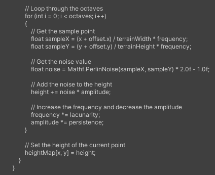

# Procedural Terrain Generator

This code generates terrain in Unity 3D using simplex noise. The generated terrain can be used in a variety of applications, including games, simulations, and visualizations. New terrain is regenerated on each launch and can be futher customized with the slider bars.

## Features

-  Create: Display an infinite combination of generations
  

-  Customize: Adjust the levels of many attributes to create variety
  

-  Explore: Use a playerObject to traverse the terrain
  

## Getting Started

To use the terrain generator, follow these steps:

1.  Drag the `TerrainGenerator` script onto a game object in your Unity scene.
2.  In the inspector, modify the script parameters to customize the terrain.
3.  Press the "Play" button to create the terrain.

## Script Parameters

The following parameters can be adjusted to customize the generated terrain:

-   **Terrain Size:** The size of the terrain in the X and Z dimensions.
-   **Height Range:** The minimum and maximum height of the terrain.
-   **Noise Scale:** The scale of the simplex noise used to generate the terrain.
-   **Material:** The material applied to the terrain.

## Examples

This code generates terrain using Perlin noise in the Unity 3D engine. The code uses a nested loop to iterate through each point in the terrain's height map, and applies Perlin noise to each point using a series of octaves.

The outer loop iterates through the x and y coordinates of the height map. The inner loop iterates through the octaves, using each octave to add noise to the current point in the height map.

For each octave, the code calculates the sampleX and sampleY values by scaling the x and y coordinates of the current point by the frequency of the octave. It then uses these values to get a noise value using the Mathf.PerlinNoise() function. The noise value is then added to the height of the current point, and the frequency and amplitude of the octave are adjusted for the next iteration.

After all octaves have been processed, the height of the current point is set in the height map. The loop then moves on to the next point in the height map, repeating the process until all points have been processed.

